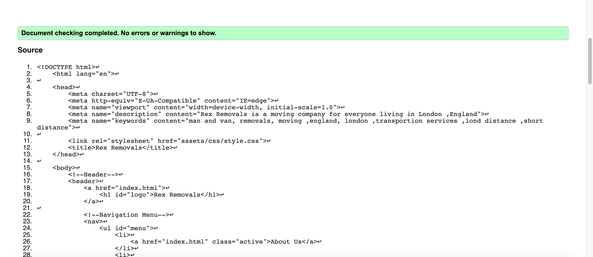

# **_Rex Removals_**

Rex Removals is a site that hopes to help people to connect to one of the best companies around,experts in moving furniture and customer care.The site will target the services offered , the customers relations and getting the help they need at a convenient price. The site will be useful for people around a specific area , who would like to move houses ,simply move furniture or purchase large and heavy items that require a large vehicle for transportation .

Welcome to <a href="http://mihayounas.github.io/rexremovals/index.html" target="_blank" rel="noopener">Rex Removals</a>

## Site Structure

Rex Removals website has four pages.The [about-us](index.html) is the default loading page , [services](services.html) , [contact](contact-us.html) and [thank-you](thank-you.html) page after submitting the message in the contact page.

# Features
Rex Removals website is set up to be easy to use . It contains features that a user would be fimiliar with ,such as navigation menu feedbacks,description of services and contact form.

## Existing Features

* ### Navigation Bar :
  * Featured on all four pages, the full responsive navigation bar includes links to the Logo, About Us, Services , Contact Us page and is identical in each page to allow for easy navigation.
  * This section will allow the user to easily navigate from page to page across all devices without having to revert back to the previous page via the ‘back’ button.
  * The logo is clickable with a link back to the home page for enhanced UX.

  
  
 
  * ### About-Us
  * The About Us includes a photograph with button overlay to allow the user to get a free quote - by pressing it  it will take him to the contact page .
  * This section introduces the user to Rex Removals with an eye catching picture to grab their attention on the services provided.
  
 

  * ### Why Choosing Us? :

  * This section will allow the user to see the benefits of choosing this company for their desired jobs .
  * This should encourage the user to consider using the services offered by Rex Removals.

* ### Feedbacks section :

* This section will allow the user to see the real opinions from real experiences of previous customers .There are four feedbacks displayed ,with the name of the customer , customer opinion and how many stars they thought the service worth.

* ### The Footer :

* The footer section includes links to the relevant social media sites for Rex Removals. The links will open to a new tab to allow easy navigation for the user.
* The footer is valuable to the user as it encourages them to keep connected via social media .
* The footer also includes a location name to allow the user to understand that this company is based in London.

* ### Services

* This page will provide the user with supporting images to see what the meet ups look like and what their services are about .

* This section is valuable to the user as they will be able to easily identify the types services the company puts together.

* ### Contact Us page :

* This page will allow the users to send a personalised message to the company asking for a quote.They will also have the ability to require extra help for the job that they are looking to be done .The user will submit their full name ,email and personalised message.
* The phone number is provided also at the bottom of the form.

* ### Form Confirmation Thank you page
    * This page confirms for the user that their details have been sent to Rex Removals. For this project it validates the form only.
    * It provides a direct link back to the main page as well as the navigation menu links in the header and footer.

# Technologies Used
* [HTML5] (https://www.w3schools.com/html/- provides the content and structure for the website.
* [CSS](https://www.w3.org/Style/CSS/Overview.en.html) - provides the styling.
* [Gitpod](https://www.gitpod.io/#get-started) - used to deploy the website.
* [Github](https://github.com/) - used to host and edit the website.

 ### Media
 * The photos all came from [Pexels](pexels.com)
 * Some of the photos were compressed using [Sqoosh]http://sqoosh.app/
 * The icons in the footer were taken from [Font-Awesome](https://fontawesome.com/) .

 * ### Validator Testing:
* HTML
No errors were returned when passing through the official W3C validator

* CSS
No errors were found when passing through the official W3C CSS validator

 * ### Deployment: 
The site was deployed to GitHub pages. 
The steps to deploy a site are as follows:
  1. In the GitHub repository, navigate to the **Settings** tab.
  2. Once in Settings, navigate to the **GitHub Pages** down on the page.
  3. Under **GitHub Pages** will be a message "Pages settings now has its own dedicated tab! Check it out here!",
  4. Press "Check it out here!" and it will take us to **GitHub Pages** where we can name our project.
  4. Once named we can select the main branch,we have to press save.After pressing save we will be provided with a link to our repository and when refreshed it will show that is it a live website , therefore successful deployment.

 The live link to the Github repository can be found here : https://mihayounas.github.io/rexremovals/ .
  
   # Acknowledgements
The site was completed as a Portfolio 1 Project 1 (HTML-CSS)for the Full Stack Software Developer at the [Code Institute](https://codeinstitute.net/). As such I would like to thank my mentors [Precious Ijege](https://www.linkedin.com/in/precious-ijege-908a00168/), and [Anton Zaharia] for their help and support.
  
  
 

